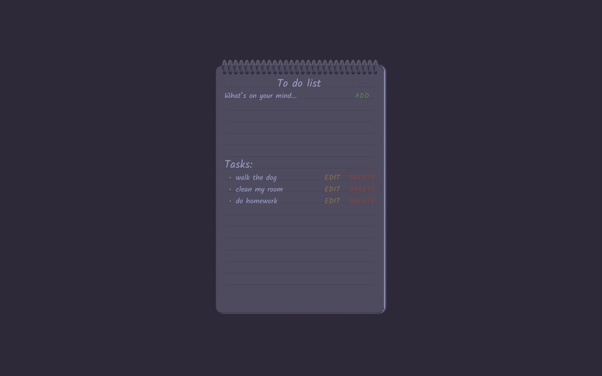
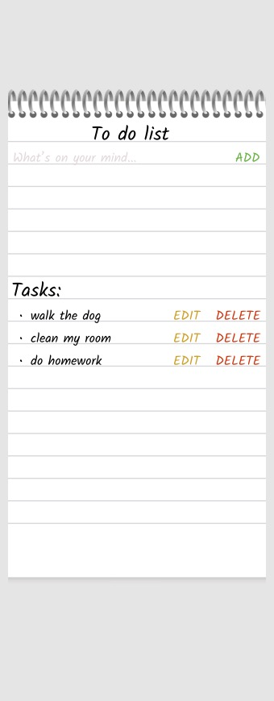

# To Do app

## General info

This project is a simple to do app created in order to practice HTML, CSS and JS.

## Features:

- enable user to input text
- add input text to tasks section via "ADD" button
- enable user to edit task via "EDIT" button
- enable user to delete task via "DELETE" button
- retain task section across browser sessions

## Design

Desktop

Dark mode

Mobile

